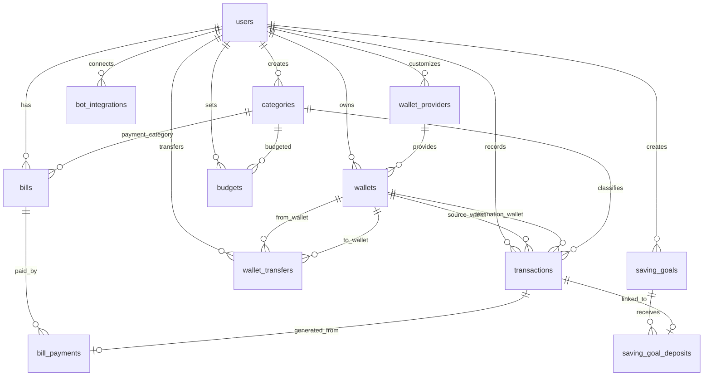

# Dokumen Rancangan Database / ERD

**FinTrack - Personal Finance Management System**

## 1. Pendahuluan

Dokumen ini menjelaskan rancangan database FinTrack. Rancangan ini mempertahankan struktur dasar PRD, tetapi diperjelas agar mendukung form dompet dinamis, provider bank/e-wallet, transfer antar dompet, riwayat pembayaran tagihan, transaksi via bot, dan pengembangan fitur lanjutan.

Dokumen ini membedakan dua hal:

1. **ERD target**: struktur ideal jangka menengah/panjang.
2. **Implementasi saat ini**: struktur yang sudah berjalan dan belum tentu sama persis dengan ERD target.

Perbedaan terbesar saat ini ada pada transfer, tagihan, dan integrasi bot:

- Transfer saat ini memakai `wallet_transfers`, bukan `transactions.type = transfer`.
- Tagihan saat ini memakai `bill_groups` dan `bill_items`, bukan `bills` dan `bill_payments` murni.
- Integrasi Telegram/WhatsApp saat ini sebagian masih memakai field di `users` dan log pesan, belum `bot_integrations`.

## 2. Daftar Entitas Utama Target

| Entitas | Deskripsi | Status Saat Ini |
|---|---|---|
| users | Data akun pengguna aplikasi. | Tersedia |
| wallet_providers | Master data penyedia dompet seperti bank dan e-wallet. | Tersedia |
| wallets | Data dompet pengguna. | Tersedia/Parsial |
| categories | Kategori pemasukan dan pengeluaran. | Tersedia/Parsial |
| transactions | Data pemasukan, pengeluaran, dan opsional transfer antar dompet. | Tersedia/Parsial |
| wallet_transfers | Transfer antar dompet pada implementasi saat ini. | Alternatif berjalan |
| bills | Data tagihan dan cicilan pada ERD target. | Alternatif via bill_groups/bill_items |
| bill_payments | Riwayat pembayaran tagihan. | Belum Ada |
| budgets | Data budget bulanan per kategori. | Belum Ada |
| saving_goals | Data target tabungan. | Belum Ada |
| saving_goal_deposits | Riwayat setoran target tabungan. | Belum Ada |
| bot_integrations | Data integrasi Telegram/WhatsApp user. | Belum Ada |

## 3. Detail Struktur Tabel Target

### users

| Field | Tipe Data | Key/Constraint | Keterangan |
|---|---|---|---|
| id | bigint | PK | Primary key |
| name | varchar | - | Nama pengguna |
| email | varchar | unique | Email login |
| password | varchar | - | Password hash |
| phone | varchar/null | - | Nomor HP |
| pin | varchar/null | - | PIN aplikasi hash |
| email_verified_at | timestamp/null | - | Waktu verifikasi |
| created_at | timestamp | - | Waktu dibuat |
| updated_at | timestamp | - | Waktu diperbarui |

Catatan implementasi: user saat ini juga menyimpan field terkait Telegram/WhatsApp. Field tersebut dapat dipertahankan sementara, tetapi target jangka panjangnya dipindahkan ke `bot_integrations`.

### wallet_providers

| Field | Tipe Data | Key/Constraint | Keterangan |
|---|---|---|---|
| id | bigint | PK | Primary key |
| user_id | bigint/null | FK users.id | Null jika provider default sistem |
| name | varchar | - | Nama bank/e-wallet |
| type | enum | bank,e_wallet | Jenis provider |
| logo | varchar/null | - | Path logo provider |
| is_default | boolean | - | True jika bawaan sistem |
| status | enum | active,inactive | Status provider |
| created_at | timestamp | - | Waktu dibuat |
| updated_at | timestamp | - | Waktu diperbarui |

Aturan:

- Provider default memiliki `user_id = null` dan `is_default = true`.
- Provider custom memiliki `user_id` pemilik dan `is_default = false`.
- Provider custom hanya tampil untuk user pembuatnya.
- Provider custom dapat dibuat dari form tambah/edit dompet dengan logo opsional PNG/JPG/WebP.
- Provider yang sudah dipakai dompet tidak dihapus permanen, tetapi dinonaktifkan.

### wallets

| Field | Tipe Data | Key/Constraint | Keterangan |
|---|---|---|---|
| id | bigint | PK | Primary key |
| user_id | bigint | FK users.id | Pemilik dompet |
| wallet_provider_id | bigint/null | FK wallet_providers.id | Provider bank/e-wallet |
| name | varchar | - | Nama dompet |
| type | enum | cash,bank,e_wallet,other | Jenis dompet |
| initial_balance | decimal(15,2) | - | Saldo awal |
| current_balance | decimal(15,2) | - | Saldo saat ini |
| account_number | varchar/null | - | Nomor rekening opsional |
| account_name | varchar/null | - | Nama pemilik rekening/e-wallet |
| phone_number | varchar/null | - | Nomor e-wallet opsional |
| custom_logo | varchar/null | - | Logo custom untuk dompet other atau kebutuhan khusus |
| is_primary | boolean | - | Dompet utama |
| status | enum | active,inactive | Status dompet target |
| created_at | timestamp | - | Waktu dibuat |
| updated_at | timestamp | - | Waktu diperbarui |

Catatan implementasi: sistem saat ini memakai `is_active`, bukan `status` enum. Ini masih dapat dipertahankan selama konsisten di controller, UI, dan query saldo aktif.

### categories

| Field | Tipe Data | Key/Constraint | Keterangan |
|---|---|---|---|
| id | bigint | PK | Primary key |
| user_id | bigint/null | FK users.id | Null untuk kategori default sistem |
| name | varchar | - | Nama kategori |
| type | enum | income,expense | Jenis kategori |
| icon | varchar/null | - | Ikon kategori |
| color | varchar/null | - | Warna kategori |
| is_default | boolean | - | Kategori bawaan sistem |
| status | enum | active,inactive | Status kategori |
| created_at | timestamp | - | Waktu dibuat |
| updated_at | timestamp | - | Waktu diperbarui |

Catatan implementasi: kategori saat ini sudah memiliki user_id, name, dan type. Metadata `icon`, `color`, `is_default`, dan `status/is_active` masih perlu ditambahkan.

### transactions

| Field | Tipe Data | Key/Constraint | Keterangan |
|---|---|---|---|
| id | bigint | PK | Primary key |
| user_id | bigint | FK users.id | Pemilik transaksi |
| wallet_id | bigint | FK wallets.id | Dompet sumber/tujuan utama |
| destination_wallet_id | bigint/null | FK wallets.id | Dompet tujuan transfer jika transfer masuk transactions |
| category_id | bigint/null | FK categories.id | Kategori transaksi |
| type | enum | income,expense,transfer | Jenis transaksi target |
| amount | decimal(15,2) | - | Nominal |
| transaction_date | date | - | Tanggal transaksi |
| note | text/null | - | Catatan |
| attachment | varchar/null | - | Bukti transaksi |
| source | enum | manual,telegram,whatsapp,ocr | Sumber transaksi |
| status | enum | success,pending,cancelled | Status transaksi |
| created_at | timestamp | - | Waktu dibuat |
| updated_at | timestamp | - | Waktu diperbarui |

Catatan implementasi:

- Saat ini `transactions` dipakai untuk income dan expense.
- Transfer dipisah ke `wallet_transfers`.
- Field `source`, `status`, dan `attachment` belum tersedia.
- Jika transfer tetap dipisah, `destination_wallet_id` dan `type = transfer` bisa tidak dipakai di implementasi final.

### wallet_transfers

Tabel ini adalah alternatif implementasi saat ini untuk transfer antar dompet.

| Field | Tipe Data | Key/Constraint | Keterangan |
|---|---|---|---|
| id | bigint | PK | Primary key |
| user_id | bigint | FK users.id | Pemilik transfer |
| from_wallet_id | bigint | FK wallets.id | Dompet sumber |
| to_wallet_id | bigint | FK wallets.id | Dompet tujuan |
| amount | decimal(15,2) | - | Nominal transfer |
| transfer_date | date | - | Tanggal transfer |
| note | text/null | - | Catatan |
| created_at | timestamp | - | Waktu dibuat |
| updated_at | timestamp | - | Waktu diperbarui |

Aturan:

- Transfer mengurangi saldo dompet sumber.
- Transfer menambah saldo dompet tujuan.
- Transfer tidak masuk perhitungan income/expense.
- Transfer dapat ditampilkan sebagai activity/riwayat.
- Jika export activity dibuat, `wallet_transfers` perlu digabung dengan `transactions` saat penyajian data.

### bills

Struktur target untuk tagihan/cicilan.

| Field | Tipe Data | Key/Constraint | Keterangan |
|---|---|---|---|
| id | bigint | PK | Primary key |
| user_id | bigint | FK users.id | Pemilik tagihan |
| wallet_id | bigint/null | FK wallets.id | Dompet pembayaran default |
| category_id | bigint/null | FK categories.id | Kategori transaksi pembayaran |
| name | varchar | - | Nama tagihan |
| amount | decimal(15,2) | - | Nominal |
| due_date | date | - | Jatuh tempo |
| frequency | enum | once,weekly,monthly,yearly | Frekuensi |
| status | enum | unpaid,paid,late,cancelled | Status tagihan |
| note | text/null | - | Catatan |
| created_at | timestamp | - | Waktu dibuat |
| updated_at | timestamp | - | Waktu diperbarui |

Catatan implementasi: sistem saat ini memakai `bill_groups` dan `bill_items`. Struktur ini dapat dipertahankan jika lebih cocok untuk tagihan berulang/cicilan, tetapi tetap perlu menyediakan payment history yang setara dengan `bill_payments`.

### bill_payments

| Field | Tipe Data | Key/Constraint | Keterangan |
|---|---|---|---|
| id | bigint | PK | Primary key |
| bill_id | bigint | FK bills.id | Tagihan terkait jika memakai tabel bills |
| bill_item_id | bigint/null | FK bill_items.id | Item tagihan jika implementasi tetap memakai bill_items |
| transaction_id | bigint/null | FK transactions.id | Transaksi hasil pembayaran |
| wallet_id | bigint | FK wallets.id | Dompet pembayaran |
| paid_amount | decimal(15,2) | - | Nominal dibayar |
| paid_date | date | - | Tanggal pembayaran |
| status | enum | paid,partial,failed | Status pembayaran |
| created_at | timestamp | - | Waktu dibuat |
| updated_at | timestamp | - | Waktu diperbarui |

Aturan:

- Pembayaran tagihan harus membuat transaksi expense otomatis.
- `transaction_id` menghubungkan payment history dengan transaksi expense.
- Jika pembayaran parsial tidak didukung, status minimal cukup `paid` dan `failed`.
- Jika tetap memakai `bill_items`, `bill_item_id` dapat menjadi relasi utama.

### budgets

| Field | Tipe Data | Key/Constraint | Keterangan |
|---|---|---|---|
| id | bigint | PK | Primary key |
| user_id | bigint | FK users.id | Pemilik budget |
| category_id | bigint | FK categories.id | Kategori budget |
| month | integer | - | Bulan |
| year | integer | - | Tahun |
| amount | decimal(15,2) | - | Jumlah budget |
| alert_percentage | integer | - | Batas peringatan |
| created_at | timestamp | - | Waktu dibuat |
| updated_at | timestamp | - | Waktu diperbarui |

### saving_goals

Target tabungan adalah modul terpisah dari dompet. Setiap target tetap terhubung ke `wallet_id` agar setoran target memiliki sumber atau tujuan saldo yang jelas.

| Field | Tipe Data | Key/Constraint | Keterangan |
|---|---|---|---|
| id | bigint | PK | Primary key |
| user_id | bigint | FK users.id | Pemilik target |
| wallet_id | bigint | FK wallets.id | Dompet tujuan |
| name | varchar | - | Nama target |
| target_amount | decimal(15,2) | - | Nominal target |
| current_amount | decimal(15,2) | - | Saldo terkumpul |
| deadline | date/null | - | Deadline |
| status | enum | active,achieved,cancelled | Status |
| created_at | timestamp | - | Waktu dibuat |
| updated_at | timestamp | - | Waktu diperbarui |

### saving_goal_deposits

| Field | Tipe Data | Key/Constraint | Keterangan |
|---|---|---|---|
| id | bigint | PK | Primary key |
| saving_goal_id | bigint | FK saving_goals.id | Target terkait |
| transaction_id | bigint/null | FK transactions.id | Transaksi setoran |
| amount | decimal(15,2) | - | Nominal setoran |
| deposit_date | date | - | Tanggal setoran |
| created_at | timestamp | - | Waktu dibuat |
| updated_at | timestamp | - | Waktu diperbarui |

### bot_integrations

| Field | Tipe Data | Key/Constraint | Keterangan |
|---|---|---|---|
| id | bigint | PK | Primary key |
| user_id | bigint | FK users.id | Pemilik integrasi |
| platform | enum | telegram,whatsapp | Platform bot |
| chat_id | varchar/null | - | Chat ID Telegram atau identifier platform |
| phone_number | varchar/null | - | Nomor WhatsApp |
| is_verified | boolean | - | Status verifikasi |
| session_status | enum | active,inactive,expired | Status sesi |
| created_at | timestamp | - | Waktu dibuat |
| updated_at | timestamp | - | Waktu diperbarui |

Aturan:

- Satu user dapat memiliki lebih dari satu integrasi bot.
- Platform yang sama sebaiknya unik per user jika hanya satu koneksi aktif diperbolehkan.
- Token, OTP, atau session secret tidak boleh disimpan dalam bentuk plaintext jika sensitif.

## 4. Relasi Antar Tabel Target

| Relasi | Jenis | Keterangan |
|---|---|---|
| users -> wallets | One to Many | Satu user dapat memiliki banyak dompet. |
| users -> categories | One to Many | Satu user dapat membuat kategori custom. |
| users -> transactions | One to Many | Satu user memiliki banyak transaksi. |
| users -> wallet_transfers | One to Many | Satu user memiliki banyak transfer antar dompet jika memakai tabel transfer terpisah. |
| users -> bills | One to Many | Satu user memiliki banyak tagihan. |
| users -> budgets | One to Many | Satu user memiliki banyak budget. |
| users -> saving_goals | One to Many | Satu user memiliki banyak target tabungan. |
| users -> bot_integrations | One to Many | Satu user dapat memiliki beberapa integrasi bot. |
| users -> wallet_providers | One to Many | Satu user dapat memiliki provider custom. |
| wallet_providers -> wallets | One to Many | Satu provider dapat digunakan oleh banyak dompet. |
| wallets -> transactions | One to Many | Satu dompet dapat memiliki banyak transaksi. |
| wallets -> wallet_transfers | One to Many | Satu dompet dapat menjadi sumber/tujuan transfer. |
| categories -> transactions | One to Many | Satu kategori dapat digunakan banyak transaksi. |
| categories -> budgets | One to Many | Satu kategori dapat memiliki budget. |
| categories -> bills | One to Many | Satu kategori dapat menjadi kategori pembayaran tagihan. |
| bills -> bill_payments | One to Many | Satu tagihan dapat memiliki banyak pembayaran. |
| bill_items -> bill_payments | One to Many | Jika memakai bill_items, satu item dapat memiliki payment history. |
| transactions -> bill_payments | One to One/Optional | Pembayaran tagihan dapat menghasilkan satu transaksi pengeluaran. |
| saving_goals -> saving_goal_deposits | One to Many | Satu target memiliki banyak setoran. |
| transactions -> saving_goal_deposits | One to One/Optional | Setoran target dapat terhubung ke transaksi. |

## 5. Kode Mermaid ERD Target

## 6. Aturan Validasi Database

- Setiap data finansial wajib memiliki `user_id` agar data antar pengguna terpisah.
- `wallet_provider_id` wajib diisi untuk tipe `bank` dan `e_wallet` jika menggunakan provider sistem/custom.
- `account_number` dan `phone_number` dibuat opsional demi privasi pengguna.
- `current_balance` tidak boleh negatif jika sistem memutuskan saldo minus tidak diizinkan.
- Jika transfer masuk `transactions`, transaksi transfer wajib memiliki `destination_wallet_id`.
- Jika transfer tetap di `wallet_transfers`, `from_wallet_id` dan `to_wallet_id` wajib berbeda.
- Kategori, dompet, dan provider yang sudah digunakan tidak dihapus permanen.
- Provider default memiliki `user_id = null` dan `is_default = true`.
- Provider custom memiliki `user_id` sesuai pemilik dan hanya tampil untuk user tersebut.
- Pembayaran tagihan harus menghasilkan transaksi expense jika pembayaran memengaruhi saldo/cashflow.
- Upload logo user dibatasi ke format aman seperti PNG/JPG/WebP kecuali SVG sudah disanitasi.

## 7. Keputusan Arsitektur yang Perlu Diputuskan

### 7.1 Transfer

Opsi A: tetap memakai `wallet_transfers`.

- Kelebihan: transfer aman dari perhitungan income/expense, implementasi sudah berjalan, activity bisa digabung saat display/export.
- Kekurangan: laporan/export harus menggabungkan dua sumber data.

Opsi B: migrasi ke `transactions.type = transfer`.

- Kelebihan: semua aktivitas finansial ada di satu tabel transaksi.
- Kekurangan: semua laporan harus disiplin exclude transfer dari cashflow, dan migrasi perlu hati-hati.

Rekomendasi saat ini: pertahankan `wallet_transfers` sampai kebutuhan export/report final jelas.

### 7.2 Tagihan

Opsi A: pertahankan `bill_groups` dan `bill_items`.

- Kelebihan: cocok untuk cicilan/tagihan berulang yang menghasilkan banyak item jatuh tempo.
- Kekurangan: berbeda dari ERD target sederhana.

Opsi B: migrasi ke `bills` dan `bill_payments` sesuai ERD target.

- Kelebihan: struktur lebih sederhana untuk PRD.
- Kekurangan: perlu migrasi dari implementasi yang sudah ada.

Rekomendasi saat ini: pertahankan `bill_groups`/`bill_items`, lalu tambahkan `bill_payments` atau tabel payment history setara yang terhubung ke `bill_items` dan `transactions`.

### 7.3 Bot Integrations

Opsi A: tetap memakai field bot di `users`.

- Kelebihan: sederhana dan sudah berjalan.
- Kekurangan: kurang rapi untuk multi-platform, multiple session, atau audit koneksi.

Opsi B: tambah `bot_integrations`.

- Kelebihan: lebih rapi untuk Telegram dan WhatsApp, mendukung status/verifikasi per platform.
- Kekurangan: perlu migrasi dan penyesuaian controller/webhook.

Rekomendasi saat ini: tunda migrasi sampai source transaksi dan pembayaran tagihan stabil, kecuali WhatsApp segera distabilkan sebagai fitur utama.

## 8. Prioritas Perubahan Database Terdekat

1. Tambahkan field kategori: `is_default`, `status` atau `is_active`, `icon`, dan `color`.
2. Tambahkan flow provider custom yang memakai struktur `wallet_providers` saat ini.
3. Tambahkan field transaksi `source` untuk manual, telegram, whatsapp, dan ocr.
4. Tambahkan field transaksi `status` jika fitur cancelled/pending akan dipakai.
5. Tambahkan payment history untuk pembayaran tagihan, idealnya terhubung ke bill item dan transaksi expense.
6. Tambahkan attachment transaksi setelah source/status stabil.
7. Tunda budgets, saving_goals, dan bot_integrations sampai core transaksi/tagihan stabil.

## 9. Kesimpulan

ERD target FinTrack mendukung struktur personal finance yang lengkap, tetapi implementasi saat ini sudah memiliki beberapa keputusan praktis yang layak dipertahankan sementara, terutama `wallet_transfers` dan `bill_groups`/`bill_items`. Fokus teknis terdekat adalah menutup gap kategori, provider custom, source transaksi, status transaksi, dan riwayat pembayaran tagihan sebelum mengerjakan budget, target tabungan, smart finance, dan integrasi lanjutan.
